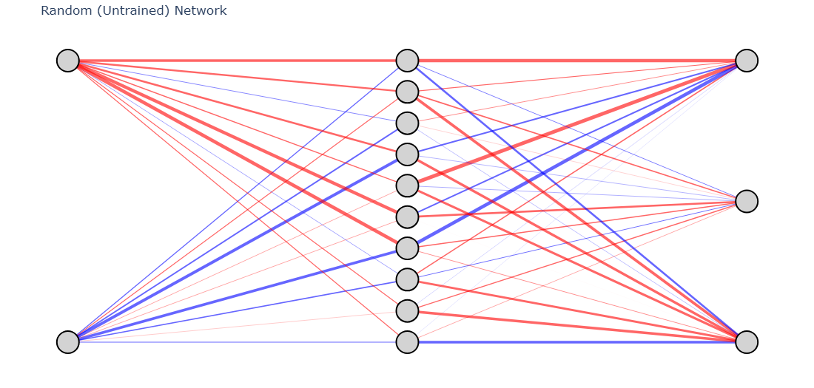

# Neural Network From Scratch 🚀

This project implements a **fully-connected neural network from scratch** in Python and NumPy.  
It covers **forward propagation, backward propagation, weight updates, activation functions, optimization techniques, and regularization methods** — all without using deep learning frameworks like TensorFlow or PyTorch.  

As a final application, the model is trained on the **Fashion-MNIST dataset** for image classification.

---

## ✨ Features

- **Custom Implementation (No Frameworks)**
  - Forward propagation
  - Backward propagation with gradients
  - Weight updates

- **Initialization**
  - Random initialization for the first layer
  - **He Initialization** for layers with ReLU activation

- **Activation Functions**
  - ReLU (hidden layers)
  - Softmax (output layer)
    
- **Loss Function**
  - Categorical Cross-Entropy Loss

- **Optimization Techniques**
  - Vanilla Gradient Descent
  - Learning Rate Decay
  - Momentum
  - Adagrad
  - RMSProp
  - Adam

- **Regularization**
  - L1 Regularization
  - L2 Regularization  
  Helps prevent **overfitting** and improves generalization.

- **Dataset**
  - Fashion-MNIST (28×28 grayscale images, 10 classes)
    
Example Predictions
---
| Image | True Label | Predicted |
| ----- | ---------- | --------- |
| 👕    | T-shirt    | T-shirt   |
| 👟    | Sneaker    | Sneaker   |
| 👜    | Bag        | Bag       |

- **🎯 Learning Outcomes**

  - By working through this project, you will gain a deeper understanding of:

  - How neural networks compute predictions (forward pass).

  - How errors propagate backward to update weights (backpropagation).

  - Why optimizers like Adam and RMSProp accelerate training.

  - How regularization prevents overfitting.

  - The internal mechanics behind popular deep learning frameworks.

  

